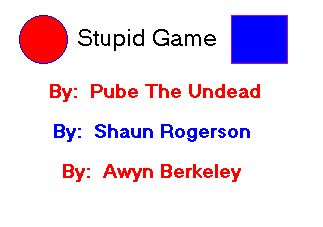



## Silly Game v3

### Description

This is the third version of the original submission "Silly Game". I added sound, comments...simplified coding ect.. The program is very clear, commenting what's going on throughout the project. I got rid of some variables and delt with objects directly to loosen up memory and speed up performance. Along with the changes I still managed to keep it simple. Programmer after programmer keeps updating this program, so anyone interested in upgrading this program even more, read the readme for documentation. Oh yeah, forgot! you can vote for me if you like what I've done.
 
### More Info
 

             |
---                |---
**Submitted On**   |2002-01-07 06:17:50
**By**             |[Alwee](https://github.com/Planet-Source-Code/PSCIndex/blob/master/ByAuthor/alwee.md)
**Level**          |Intermediate
**User Rating**    |5.0 (10 globes from 2 users)
**Compatibility**  |VB 6\.0
**Category**       |[Games](https://github.com/Planet-Source-Code/PSCIndex/blob/master/ByCategory/games__1-38.md)
**World**          |[Visual Basic](https://github.com/Planet-Source-Code/PSCIndex/blob/master/ByWorld/visual-basic.md)
**Archive File**   |[Silly\_Game46918172002\.zip](https://github.com/Planet-Source-Code/alwee-silly-game-v3__1-30488/archive/master.zip)

### API Declarations

Yes, 1 for playing wavs.

